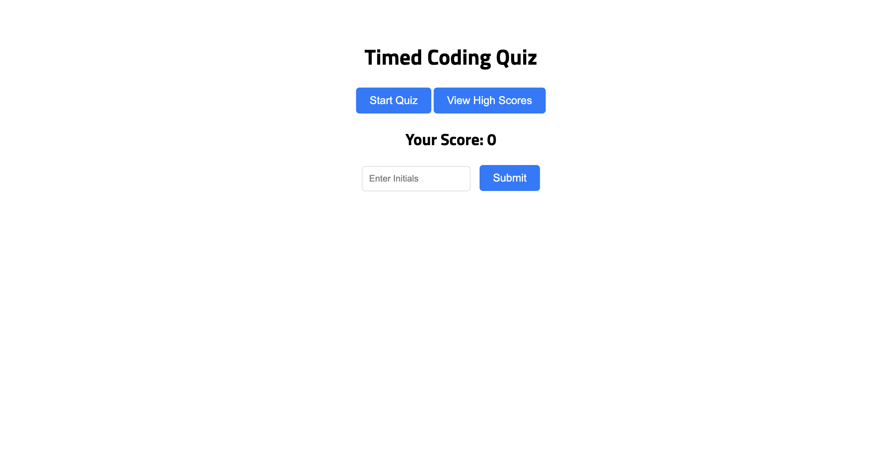

# Timed Code Quiz

## Overview

This project is a web-based timed coding quiz designed to test knowledge on basic programming fundamentals. It features a series of multiple-choice questions, a countdown timer, and the ability to save high scores for comparing performance with peers.

## Features

Start Quiz: Clicking the start button begins the timer and displays the first question.
Question Navigation: Answering a question presents the next one.
Time Penalty: Incorrect answers result in a time deduction.
Quiz Completion: The quiz ends when all questions are answered or the timer reaches zero.
Score Submission: Users can save their initials along with their score.

## Technologies Used

HTML
CSS
JavaScript

## Usage

Upon loading the application in your browser, you will be greeted with a start screen. Click the "Start Quiz" button to begin. Answer the multiple-choice questions as quickly as possible - incorrect answers will reduce your remaining time. At the end of the quiz, you can save your score with your initials.

## Acknowledgements

This project was supported by various resources and tutorials. Special thanks to the following sites for providing valuable information and guidance:

Quiz Questions: [JavaScript Developer Quiz](https://developerquiz.org/)

Event Handling in JavaScript: [Stack Overflow: Understanding the e (event) parameter](https://stackoverflow.com/questions/35936365/what-exactly-is-the-parameter-e-event-and-why-pass-it-to-javascript-functions)

Working with Local Storage: [Stack Overflow: Retrieve local storage array](https://stackoverflow.com/questions/30541850/retrieve-local-storage-array-list-using-json-parse)

Mapping Objects for HTML Manipulation: Stack Overflow: [Mapping an object and setting innerHTML](https://stackoverflow.com/questions/44062723/mapping-an-object-and-then-setting-innerhtml-on-the-page-results-in-commas-betwe)

Understanding the join() method: [MDN Web Docs: Array.prototype.join()](https://developer.mozilla.org/en-US/docs/Web/JavaScript/Reference/Global_Objects/Array/join)

## Deployed App and Link

Here's a look at the deployed application: https://akent90.github.io/module-4-challenge/

## License

This project is open-source and available under the MIT License.
